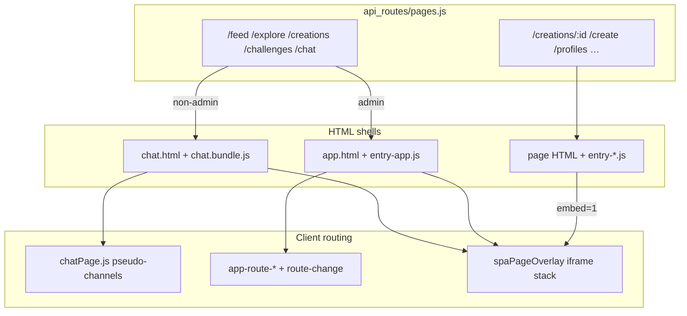

# Cleanup: SPA migration leftovers

The app is migrating to a chat-first SPA. Most logged-in users never hit the old `app.html` shell anymore. This doc inventories what is orphaned, what is in transition, and what still needs consolidation.

## Where we are now

**Consumer lanes** (`/feed`, `/explore`, `/creations`, `/challenges`, `/chat/*`) serve `pages/chat.html` with the Rollup bundle (`/build/chat.bundle.js`). Lane UI lives in `src/chat/chatPage.js` as pseudo-channels, not `app-route-*` components.

**Admin lane URLs** still serve `pages/app.html` or `pages/app-admin.html` with the legacy shell (`data-entry="app"` / `app-admin`).

**Detail and workflow pages** are standalone HTML pages that can also load inside an iframe overlay when navigated from within a shell. That dual mode is intentional for now — not orphaned, but a transition point.

**Overlay intercept** is centralized in `src/shared/spaPageOverlay.js` (duplicated in `public/shared/`). Shells with `data-entry="app"`, `app-admin`, or `chat` intercept matching links and open `?embed=1` iframes instead of full navigation.

Stale docs: `_docs/_ARCHITECTURE_ROUTE_LOAD.md` and `ROUTES.md` still describe the all-routes-in-`app.html` model for consumers. Update when cleaning up.

---

## Orphaned and legacy (safe to target for removal)

These files exist from the pre-chat-first shell. They are either unused, admin-only dead weight, or broken.

### Legacy app-shell route components

Loaded by `public/pages/entry/entry-app.js`, mounted only in `pages/app.html`. Non-admin users on `/feed` etc. never see them — they get `chat.html` instead (`api_routes/pages.js` ~1655–1686).

| File | Element | Notes |
|---|---|---|
| `public/components/routes/feed.js` | `app-route-feed` | Superseded by `src/chat/feed/*` |
| `public/components/routes/explore.js` | `app-route-explore` | Superseded by explore pseudo-channel in chat |
| `public/components/routes/creations.js` | `app-route-creations` | Superseded by creations pseudo-channel in chat |
| `public/components/routes/templates.js` | `app-route-templates` | Never mounted in any HTML; fully orphaned |

`public/components/routes/servers.js` (`app-route-servers`) is still on `app.html` and `app-admin.html` for the Connect tab — not orphaned yet, but slated for retirement per `_docs/PLAN_chat_nav_unification.md`.

### Broken / unused entry bootstrap

| File | Issue |
|---|---|
| `public/pages/entry/entry-chat.js` | Imports `../chat.js`, which no longer exists (`initChatPage` moved to `src/chat/chatPage.js`). `chat.html` loads the bundle directly, not `entry.js`, so this path is never hit. |
| `public/global.js` | Marked legacy; falls back to `entry.js` with `data-entry=app`. Superseded by per-page `entry-*.js` via `public/entry.js`. |

### Legacy HTML shell

| File | Issue |
|---|---|
| `pages/app.html` | Original multi-route SPA. Still served to admins on lane URLs and as role fallback. Consumer traffic bypasses it. Long-term: serve chat shell to admins too, then delete or shrink. |

### Admin-only routes (not orphaned, but not SPA-migrated)

Still valid for `app-admin.html` — do not delete without an admin replacement.

- `public/components/routes/todo.js`, `users.js`, `analytics.js`
- `public/pages/admin.js` (inline admin tabs)

### Partially migrated create

- `public/components/routes/create.js` — only used on `pages/createAdvanced.html`
- Basic `/create` uses `entry-create.js` + `createPageRuntime.js` instead

### Deprecated re-export shims

Wide imports still point at these instead of `spaPageOverlay.js` directly:

- `public/shared/creationDetailOverlay.js`
- `public/shared/promptLibraryOverlay.js`

### Stale `/connect` references

Nav unification is incomplete. Remaining legacy `/connect` / `data-route="connect"` usage:

- `public/components/routes/servers.js`
- `public/shared/chatSidebarRoster.js` (+ `src/shared/` copy)
- `api_routes/utils/chatDeepLinks.js`
- `pages/app.html`, `pages/app-admin.html` (`data-route-content="connect"`)
- Mobile nav `data-route="connect"` label "Chat"

See `_docs/PLAN_chat_nav_unification.md`.

---

## Transition points: overlay dual-mode pages

These pages are **not** orphaned. They deliberately serve two modes:

1. **Standalone** — direct URL loads full page with chrome (nav, etc.)
2. **Embed** — `?embed=1` loads a stripped document; `spaPageOverlay.js` opens it in an iframe when the user navigates from within a shell

Each page has three layers:

- HTML shell in `pages/`
- Page script in `public/pages/` (or entry module in `public/pages/entry/`)
- Embed runtime in `public/shared/*Runtime.js` (some duplicated under `src/shared/` for the chat bundle)

Server injects embed flags in `api_routes/pages.js` when `?embed=1`.

| Route | HTML | Page JS | Runtime | Embed flag |
|---|---|---|---|---|
| `/creations/:id` | `creation-detail.html` | `creation-detail.js` | `creationDetailRuntime.js` | `__ps_creation_detail_embed` |
| `/creations/:id/edit`, `/mutate` | `creation-edit.html` | `creation-edit.js` | `creationEditRuntime.js` | `__ps_creation_edit_embed` |
| `/create` | `create.html` | `entry-create.js` | `createPageRuntime.js` | `__ps_create_embed` |
| `/prompt-library` | `prompt-library.html` | `prompt-library.js` | `promptLibraryRuntime.js` | `__ps_prompt_library_embed` |
| `/user`, `/user/:id`, `/p/:handle` | `user-profile.html` | `user-profile.js` | `profilePageRuntime.js` | `__ps_profile_embed` |
| `/styles/:slug` | `style-detail.html` | `style-detail.js` | `styleDetailRuntime.js` | `__ps_style_embed` |
| `/audio-clips/:id` | `audio-clip-detail.html` | `audio-clip-detail.js` | `audioClipDetailRuntime.js` | `__ps_audio_clip_embed` |
| `/integrations` | `integrations.html` | `integrations-main.js` | `integrationsRuntime.js` | `__ps_integrations_embed` |

Shared overlay infrastructure (also duplicated public/src):

- `spaPageOverlay.js` — intercept, history, iframe stack
- `embedPageRuntime.js` — postMessage bridge between iframe and parent
- `creationDetailEmbedShell.js` — creation detail embed chrome

**Cleanup implication:** do not delete these until overlay navigation is replaced (e.g. by in-shell components or a single bundle route). Consolidation work is merging public/src copies and eventually dropping the iframe layer — not removing the pages.

**Special case — in-chat overlay (not iframe):** doom scroll (`src/chat/feed/chatDoomScrollOverlay.js`, `doomScrollMount.js`) is a fullscreen overlay inside the chat shell at `/chat/c/feed/doom/:creationId`. Different mechanism from `spaPageOverlay`.

**Hotfix layer:** `public/pages/chat-hotfix.js` patches bundle behavior post-load (overlay nav from profile embed, inline media grouping). Shrink as bundle catches up.

---

## `public/` vs `src/` duplication

Two parallel trees exist because unbundled pages import from `public/` while the chat bundle resolves shared modules from `src/` (see `src/rollup.config.mjs`).

Roughly **60** identical filenames in both `public/shared/` and `src/shared/`. Navigation and modal web components are duplicated under `public/components/` and `src/shared/components/`.

**public-only** (unbundled pages, no bundle copy yet): `pageInit.js`, `createPageRuntime.js`, `creationEditRuntime.js`, `createSubmit.js`, `connectServersCache.js`, and ~35 others.

**src-only** (bundle-only): `runBundledCommonInit.js`, `waitForComponents.js`, `chatFeedMobilePartition.js`, `feedHiddenItems.js`, `feedBetaContinuation.js`, `challengeHistoryThumb.js`, `chatUploadMaxBytes.js`.

Files with explicit sync comments (edit both or consolidate):

- `notificationNav.js` — "Chat SPA imports the copy under src/shared/…"
- `runBundledCommonInit.js` — "keep aligned when editing global listeners" with `pageInit.js`

Long-term: single source for shared modules with Rollup aliasing for all consumers. Until then, any edit to overlay runtimes or card builders may need both copies.

---

## Standalone pages (not overlay, not orphaned)

These use `entry-*.js` + dedicated HTML and are not intercepted by `spaPageOverlay`:

- `entry-auth.js`, `entry-welcome.js`, `entry-help.js`, `entry-pricing.js`, `entry-try.js`
- `entry-blog-edit.js`, `entry-not-found.js`, `entry-landing.js`
- `entry-app-admin.js` (admin shell)

Landing (`public/pages/index.js`) is a separate pattern — inline script in `index.html`, not the entry system.

---

## Suggested cleanup order

1. Fix or delete `entry-chat.js` (broken import, unused path).
2. Delete `app-route-templates` (`templates.js`) or wire it up if still needed.
3. Finish `/connect` → `/chat` sweep (`PLAN_chat_nav_unification.md`).
4. Confirm admins can use chat shell on lane URLs; then remove `app-route-feed` / `explore` / `creations` from `app.html` and `entry-app.js`.
5. Retire `servers.js` tabbed hub once chat hub fully replaces Connect.
6. Redirect deprecated overlay shim imports to `spaPageOverlay.js`.
7. Update `_ARCHITECTURE_ROUTE_LOAD.md` and `ROUTES.md`.
8. Consolidate `public/`/`src/` shared modules (highest ongoing maintenance cost).
9. Migrate `createPageRuntime.js` and `creationEditRuntime.js` into `src/shared/` for bundle parity.
10. Shrink `chat-hotfix.js` as bundle behavior stabilizes.
