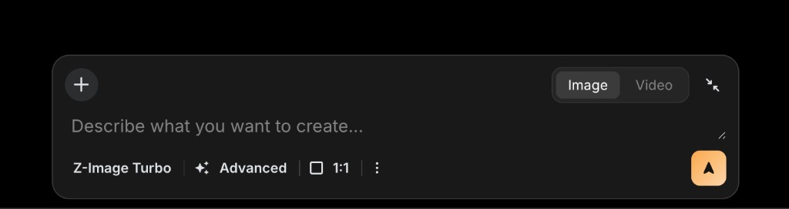

# Plan: aspect ratios beyond 1:1

Pick ratio at create/edit → provider returns matching pixels → UI shows real proportions.

## Why it feels big

- Generation — args, uploads, jobs, providers (create, edit, video)
- Storage — `width` / `height` on row; job reads output dims; placeholders + uploads still 1024²
- Display — many `aspect-ratio: 1 / 1` tiles, skeletons, modals, chat, share

## Already in repo

- Landscape 16:9 — outpaint side asset (`meta.landscapeUrl`), not create-time ratio
- Doom scroll — letterbox for non-portrait video
- `creationJob` — defaults 1024², updates width/height from sharp after provider

## Ratios

### MVP picker (ship first)

- 1:1 — default
- 9:16 — reels / stories
- 4:5 — instagram feed
- 16:9 — youtube / landscape

### Phase 2

- source — match reference image dims (edit, i2v); no square crop on that path

### Later (competitor UIs)

- 3:4, 2:3, 4:3, 3:2, 5:4
- 21:9 — low priority

User ask (baristagirls): 9:16, 4:5, 16:9, video sized to image.

## Contract

- `meta.args.aspect_ratio` — string key (`1:1`, `9:16`, `source`, …)
- One server module — key → WxH per method + model; long edge ~1024 unless provider docs say otherwise
- Job complete — persist real width/height (already in `creationJob.js`)
- Placeholder insert — mapped dims, not hardcoded 1024²
- Uploads — today force 1024² cover (`create.js`, `images.js`); skip or resize to target when ratio set

## Providers (inventory before UI)

- Text-to-image — replicate, grok-imagine (basic create, `/gen`, try)
- Edit / mutate — same + image_url / input_images
- Video — replicateVideo, WAN, LTX i2v
- Landscape outpaint — advanced_generate outpaint; overlaps 16:9 — reconcile later

Spike blockers:

- grok-imagine aspect/size params?
- WAN / LTX output vs input dims?
- 1:1-only models — hide ratios or clear error

## UI display

Intrinsic ratio from row `width` / `height` where possible.

### Must fix early

- Feed `.feed-card-image`
- Creations / explore / profile `.route-media`
- Detail hero `.creation-detail-image-wrapper`
- Creation edit preview
- Modals — details, publish, share
- Chat embeds, doom scroll
- Skeletons, processing tiles

### Later

- Try, landing grid, admin, OG/unfurl, email, Vynly export

### Pattern

- Container `aspect-ratio` from width/height (attr or style)
- Grids — `object-fit: cover`
- Detail — `contain` vs cover (pick once)
- Shared helper for feed + route cards — see `PLAN_Component_generalization.md`

## Create page (basic `/create`)

Reference mock — `_docs/PLAN_aspect_ratios_create_ui.png`

### Today

- `pages/create.html` — `app-tabs`: Text-To-Image + Image Edit
- Title + prompt + full-width Create button per tab
- Text-To-Image — style carousel below prompt (many cards)
- Image Edit — separate choose-image box + prompt + Edit button
- Footer link — Advanced mode only
- No aspect control; implicit 1:1

### Target (composer card)

Single dark rounded panel — prompt-first, settings in a bottom bar (see mock).

Top row

- `+` — attach reference image (replaces / complements Image Edit tab flow)
- Image | Video — segmented toggle (video = phase 3 or hidden until i2v on create page)
- Collapse — shrink composer (optional)

Body

- One textarea — “Describe what you want to create…”
- Autogrow + resize handle

Bottom toolbar (left → right)

- Model — label for current default (e.g. grok-imagine); tap → model sheet later
- Advanced — link to `/createAdvanced` or inline sheet
- Aspect — icon + current ratio label (e.g. `1:1`); tap → ratio popover (icon grid from competitor mocks)
- `⋮` — overflow (style picker?, credits, help)
- Submit — primary square button, up-arrow (replaces separate Create / Edit buttons)

Style picker

- Move out of main scroll — overflow menu, slide-over, or secondary step (keep carousel behavior, less dominant)

### Aspect on create page

- Toolbar chip shows active ratio; popover lists MVP four
- Pass `aspect_ratio` in submit args (`entry-create.js` / `createSubmit.js`)
- Image attach — preview thumb near `+`; respect ratio on upload resize
- Video mode — ratio still applies to output frame; or lock to source when image attached

### Files (likely)

- `pages/create.html` — new composer markup
- `public/pages/creations.css` or `create.css` — composer + toolbar + popover
- `public/pages/entry/entry-create.js` — wire toggle, aspect, attach, submit
- Reuse ratio popover component on creation-edit later

### Create page phases

- With phase 2 — composer shell + aspect chip + popover (image mode only)
- Phase 3 — video toggle + source ratio when attach present
- Defer — model picker sheet, collapse, full overflow menu polish

## UI picker (other surfaces)

- MVP — creation-edit (image modes); same popover as create toolbar
- Defer — advanced create route, `/gen`, try
- Remember last choice — localStorage (like i2v engine)

## Phases

### Phase 0 — spike

- Provider matrix — method → ratios → args
- Manual create 9:16 + 16:9 — check DB + file dims

### Phase 1 — backend only

- `aspectRatio.js` — keys, WxH map, validate
- `POST /api/create` → meta.args → creationJob payload
- Placeholder dims from map
- Upload path — no blind 1024² when ratio set

### Phase 2 — MVP ship

- Create page composer + aspect toolbar chip + popover (see above)
- Picker four ratios on creation-edit
- Feed, creations grid, detail hero — intrinsic aspect
- Skeletons from pending meta or 1:1 fallback

### Phase 3 — edit + video

- Mutate / i2v pass aspect_ratio
- source = reference image dims
- Thumbnail dims follow source
- Retest watermark, share, NSFW blur

### Phase 4 — expand

- More presets if providers allow
- `/gen`, try, advanced create
- Landscape vs primary 16:9 — keep, merge, or deprecate
- Route card factory if still duplicated

## Risks

- Provider rejects ratio — gate UI from server capabilities
- Grid row height — uniform crop vs variable cells
- Embeddings — likely fine; verify
- Old rows — wrong dims in DB → display wrong until regen
- landscapeUrl vs primary 16:9 — two concepts on one row

## MVP done

- Create composer with aspect chip; ratios 1:1 / 9:16 / 4:5 / 16:9
- Same ratios on creation-edit
- Job finishes with matching width/height in DB
- Feed + detail not forced square on media
- Four ratios documented per provider path; bad combos hidden or errored

## Open

- Long edge 1024 vs native provider sizes
- Grid — fixed cell + crop vs true aspect rows
- Keep landscape outpaint after primary 16:9 create?
